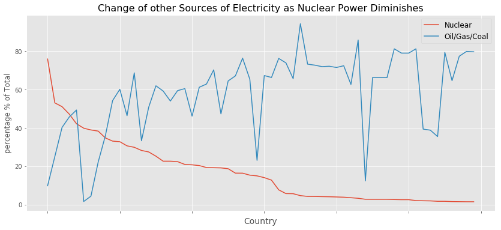

# DATS 6103-Individual Project 3-Xi Zhang
## Overview of Access of Electricity to the World
Overview of global electricity access from 2000 to 2015.

The world map gives a very visual view of how electricity rates have changed in different countries over the past decade.The bar chart illustrates that the global electricity supply rate has been rising steadily since 2000.

## The State of Nuclear Power in Electricity
Due to the economic advantages and environmental considerations, nuclear power has become the most potential and most likely to gradually replace the traditional energy generation mode in recent years. But because of upfront costs and international regulations, not every country can afford nuclear power. So this time I will study ten countries with nuclear power plants and further illustrate he state of nuclear power in electricity.

It is clear that France is the world leader in the use of nuclear power for electricity, far ahead of other countries (accounting for about 80% of total electricity generation and 7.6 percent of the world's nuclear power generation). Therefore, I will take France as an example to analyze the growth rate of nuclear power generation in recent years and the interaction between nuclear power generation and traditional power generation. And a rough prediction for the next few years.

It can be seen from the two histograms that the increase and decrease of nuclear energy are obviously higher than other energy sources, but for France, the growth rate of nuclear energy is still higher in recent years.And it seems that while nuclear power is on the rise, other sources of energy are likely to decline in the same year.

The relationship between two different energy sources is more intuitive in the line diagram. In this 15-year data, we can see that the peak value of nuclear energy often corresponds to the valley value of other energy sources. And we can see that in recent years, the growth of nuclear power generation has decreased, while the growth of traditional energy has increased. So we can expect France's traditional energy consumption to increase in the next few years. In the following research, I will continue to discuss the relationship between nuclear energy and other energy sources in detailed categories.

## The Impact of Nuclear and other Sources of Electricity

As the use of nuclear power declines (especially below 50 percent), countries tend to have a single source that is the country's primary source of electricity. This single resource is often many times larger than any other resource except nuclear power (such as Switzerland and Bulgarian coal).This may represent this country's main source of electricity generation before nuclear power.

More than 80 percent of France's electricity comes from nuclear power. In Bulgaria, coal produces more than half the electricity. In addition to nuclear power, coal is far more important in Bulgaria than hydropower or oil.This further illustrates what the main source of electricity was before nuclear power. This nested pie chart is a milestone in the recent development of nuclear power.

But with the development of time, what does the development of nuclear energy bring to the traditional power resources? The 60 countries selected are ranked in descending order of nuclear power use. With the decrease of the utilization rate of nuclear energy, it is obvious that the utilization rate of oil, gas and coal is gradually increasing. So nuclear power does complement other sources of electricity.

In these scatter plots, we can see that coal, oil and hydropower are negatively correlated with nuclear power, among which nuclear power has the greatest impact on coal and the least impact on hydropower. But we can expect coal and fuel to be replaced as nuclear power becomes more widely used. As a result, less and less waste gas will be released into the atmosphere, and our environment will eventually be improved.

## Reference
The World Bank Group (2019). Access to electricity (% of population), from 
    https://data.worldbank.org/indicator/EG.ELC.ACCS.ZS
The World Bank Group (2019). Electricity production from nuclear sources (% of total), from 
    https://data.worldbank.org/indicator/EG.ELC.NUCL.ZS
The World Bank Group (2019). Electricity production from coal sources (% of total), from 
    https://data.worldbank.org/indicator/EG.ELC.COAL.ZS
The World Bank Group (2019). Electricity production from coal sources (% of total), from 
    https://data.worldbank.org/indicator/EG.ELC.PETR.ZS
The World Bank Group (2019). Electricity production from hydroelectric sources (% of total), from 
    https://data.worldbank.org/indicator/EG.ELC.HYRO.ZS
The World Bank Group (2019). Electricity production from oil, gas and coal sources (% of total), from 
    https://data.worldbank.org/indicator/EG.ELC.FOSL.ZS

